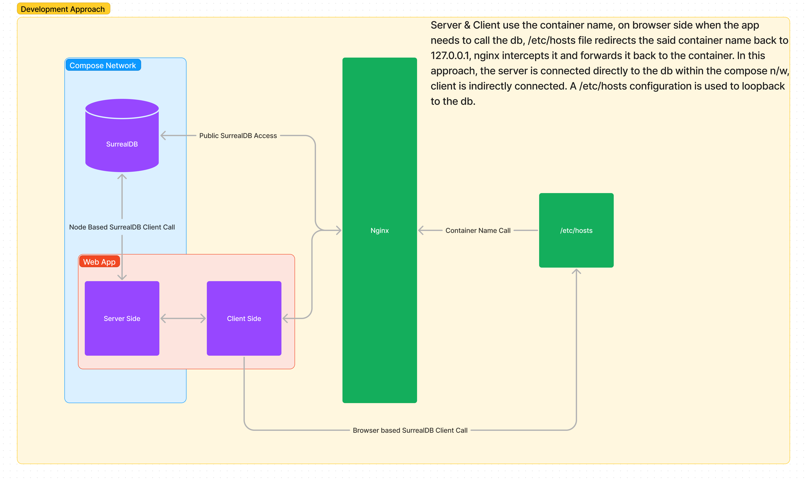
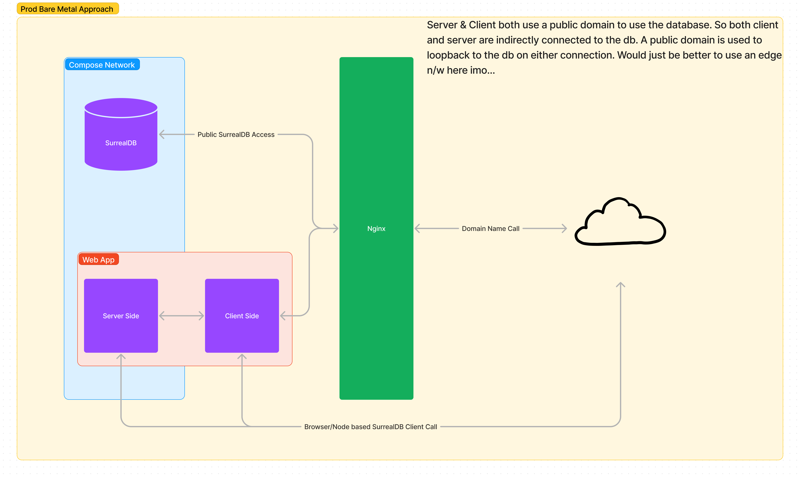

# SvelteKit Surreal Auth

## Credit where it's due
NGL I was pretty lost when I started this out due to how surrealdb interacts with the server AND THE CLIENT DIRECTLY!! 

and the repo below helped me greatly develop an implementation that JUST WORKED... [check it out here](https://github.com/oskar-gmerek/surreal-sveltekit)

## What is this
A basic bare bones implementation of surrealdb auth in a sveltekit app, nothing more

## DB Connection Implementation
### Development/Local Implementation
> If you are a madman that has a public domain pointed to your home internet, use the prod guide lol

#### How to run 
1. point database (surreal container name in this proj) to 127.0.0.1 through /etc/hosts
2. docker compose up
3. then sign into the root under db: ssa and ns: ssa
4. run the surql script given [here](db/migrations/initial.surql)
5. run the project with bun/yarn/pnpm/npm anything
6. /login and /register would be the urls of your interest
7. after registration, you'd be redirected to login page
8. after login you should see a console log in the inspector about the user you signed in with

### Production (@ Bare Metal) Implementation

#### How to run
1. configure your vps nginx to point to the apps in the project through your domain
2. docker compose -f prod.docker-compose.yml up
3. then sign into the root under db: ssa and ns: ssa
4. run the surql script given [here](db/migrations/initial.surql)
5. run the project with bun/yarn/pnpm/npm anything
6. /login and /register would be the urls of your interest
7. after registration, you'd be redirected to login page
8. after login you should see a console log in the inspector about the user you signed in with